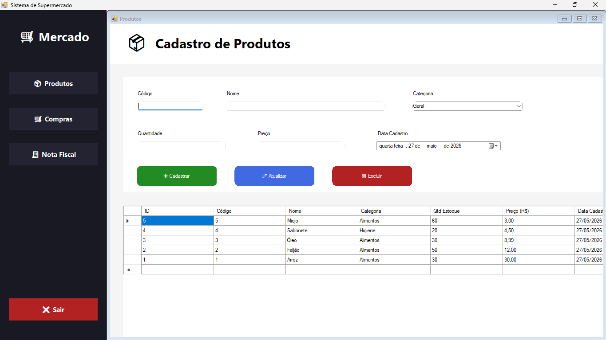
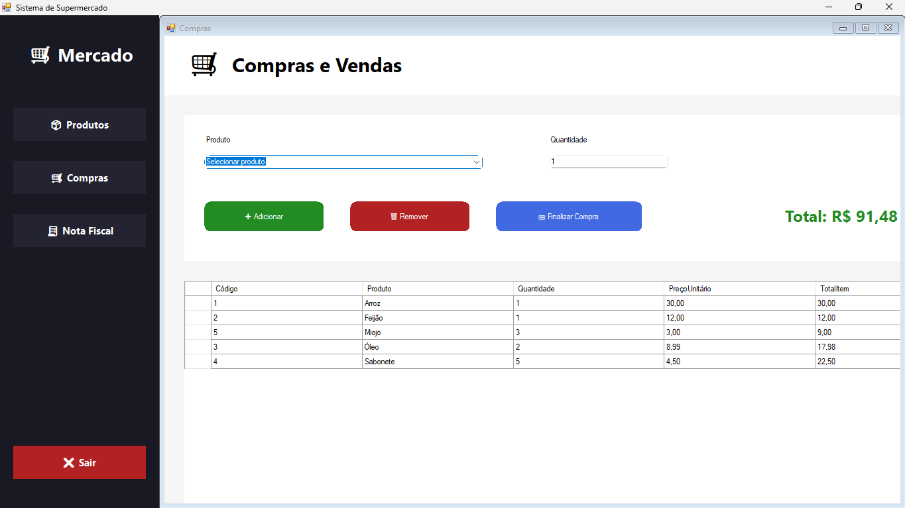
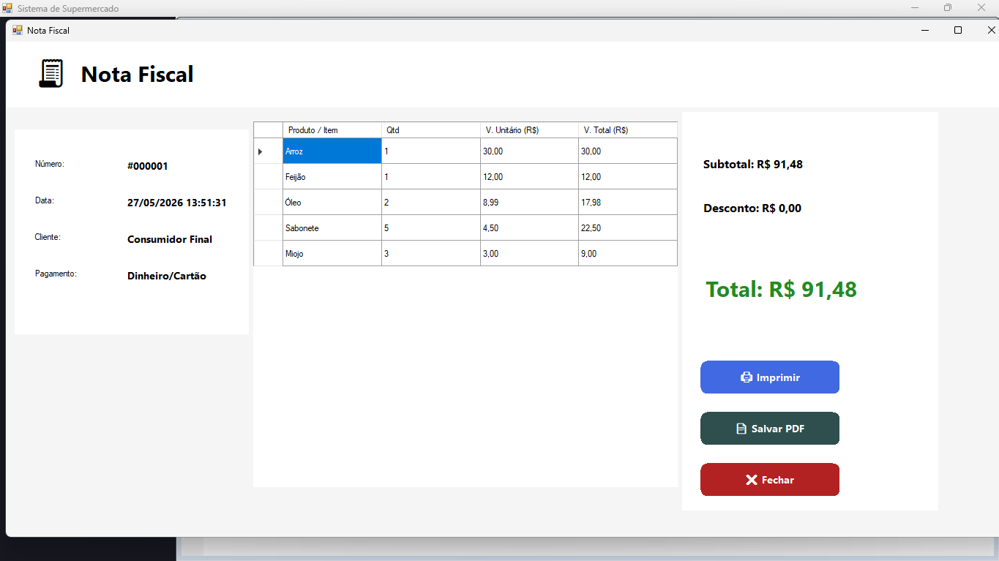
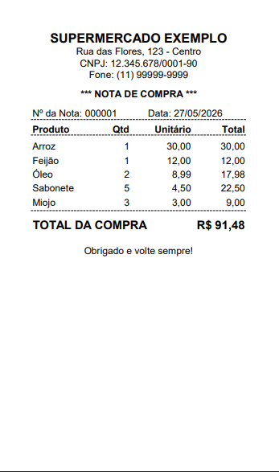

# 🛒 Sistema de Supermercado Desktop

> Um sistema completo para gestão de mercado com PDV, controle de estoque e nota fiscal em PDF.

---

## 📑 SUMÁRIO

- [Sobre o Projeto](#sobre-o-projeto)
- [Funcionalidades Principais](#funcionalidades-principais)
- [Tecnologias Utilizadas](#tecnologias-utilizadas)
- [Banco de Dados](#banco-de-dados)
- [Demonstração Visual (Prints)](#demonstração-visual-prints)
- [Como Executar](#como-executar)

---

## 🧾 SOBRE O PROJETO

O **Sistema de Supermercado Desktop** foi criado para facilitar a operação de mercados e mercearias, entregando uma experiência robusta e prática de gestão de produtos, frente de caixa e emissão de nota fiscal.

O projeto combina:
- cadastro completo de produtos,
- fluxo de vendas em estilo PDV,
- baixa automática de estoque via transações MySQL,
- geração de nota fiscal real com exportação em PDF.

> Ideal para quem busca um controle mais profissional do ponto de venda e automação das rotinas de estoque.

---

## ✨ FUNCIONALIDADES PRINCIPAIS

- 🧾 **Gerenciamento de Produtos**
  - CRUD completo de produtos
  - cadastro, edição, exclusão e listagem detalhada
  - controle de preços e estoque

- 🛍️ **Frente de Caixa / Carrinho de Compras**
  - interface intuitiva para venda rápida
  - seleção de produtos e cálculo automático de valores
  - experiência fluida para uso no atendimento ao cliente

- 📉 **Baixa Automatizada de Estoque**
  - atualização imediata de estoque após venda
  - transações seguras usando `MySqlTransaction`
  - evita inconsistências e perdas na operação diária

- 🧾 **Emissão de Nota Fiscal**
  - geração de nota fiscal real
  - exportação em PDF para comprovantes e arquivos
  - visualização organizada e profissional

---

## 🛠️ TECNOLOGIAS UTILIZADAS

| Tecnologia | Uso |
|---|---|
| 🟦 `C#` | Lógica de negócio e interface desktop |
| ⚙️ `.NET` | Plataforma de desenvolvimento |
| 🪟 `Windows Forms` | Interface gráfica nativa do Windows |
| 🐬 `MySQL` | Banco de dados relacional |
| 🖨️ Ferramentas nativas Windows | Impressão, desenho e exportação para PDF |

> O projeto é estruturado para funcionar como uma aplicação desktop clássica, aproveitando o ecossistema Windows e MySQL para máximo desempenho e compatibilidade.

---

## 💾 BANCO DE DADOS

O schema principal está organizado no arquivo `supermercado_db.sql`.

Este arquivo inclui:
- criação do banco de dados `supermercado_db`
- tabelas essenciais: `produtos`, `vendas`, `itens_venda`, `clientes` e `notas_fiscais`
- definições de campos, chaves primárias e relacionamentos
- fluxos de integridade para o controle de estoque e notas fiscais

### Estrutura recomendada

| Recurso | Descrição |
|---|---|
| `supermercado_db.sql` | Script SQL para criar e inicializar o banco de dados |
| `produtos` | Tabela de cadastro de produtos e estoque |
| `vendas` | Registro de vendas e transações de PDV |
| `itens_venda` | Itens adicionados ao carrinho por venda |
| `notas_fiscais` | Dados e metadados da nota fiscal gerada |

> Use o arquivo `supermercado_db.sql` para criar rapidamente o banco de dados e manter o ambiente consistente em diferentes máquinas.

---

## 🖼️ DEMONSTRAÇÃO VISUAL (PRINTS)

<div align="center">









</div>

---

## ▶️ COMO EXECUTAR

### 1. Clonar o repositório

```bash
git clone https://github.com/seu-usuario/seu-repositorio.git
cd "Sistema de Supermercado"
```

### 2. Configurar o banco de dados MySQL

- Crie a base de dados no MySQL
- Atualize a string de conexão no arquivo de configuração:
  - `App.config`
  - `ConexaoBD.cs`
- Exemplo de conexão:
```xml
<connectionStrings>
  <add name="MinhaConexao"
       connectionString="Server=localhost;Database=nome_do_banco;Uid=usuario;Pwd=senha;"
       providerName="MySql.Data.MySqlClient" />
</connectionStrings>
```

### 3. Abrir a solução no Visual Studio

- Abra o arquivo: `Sistema de Supermercado.sln`
- Verifique se os pacotes NuGet estão restaurados
- Confirme a referência ao `MySql.Data`

### 4. Executar a aplicação

- No Visual Studio, selecione o modo `Debug`
- Pressione `F5` ou clique em **Iniciar**
- A aplicação será aberta com o sistema pronto para uso

> Para um funcionamento completo, certifique-se de que o serviço MySQL esteja ativo antes de iniciar a aplicação.

---
